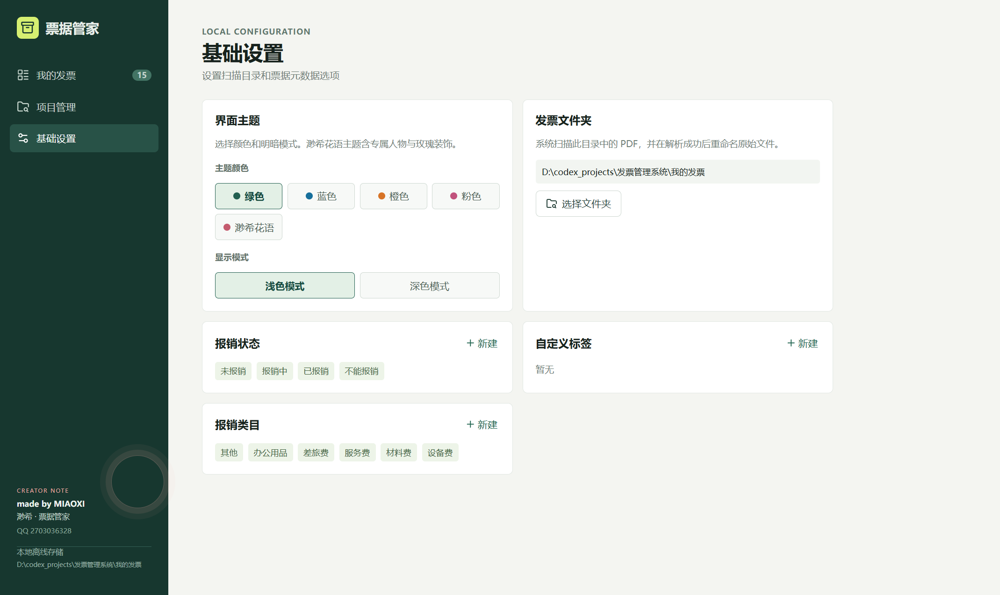
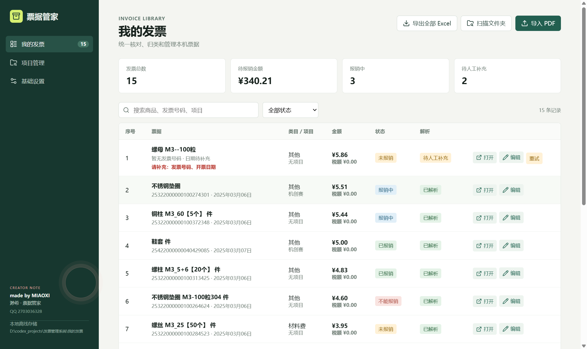
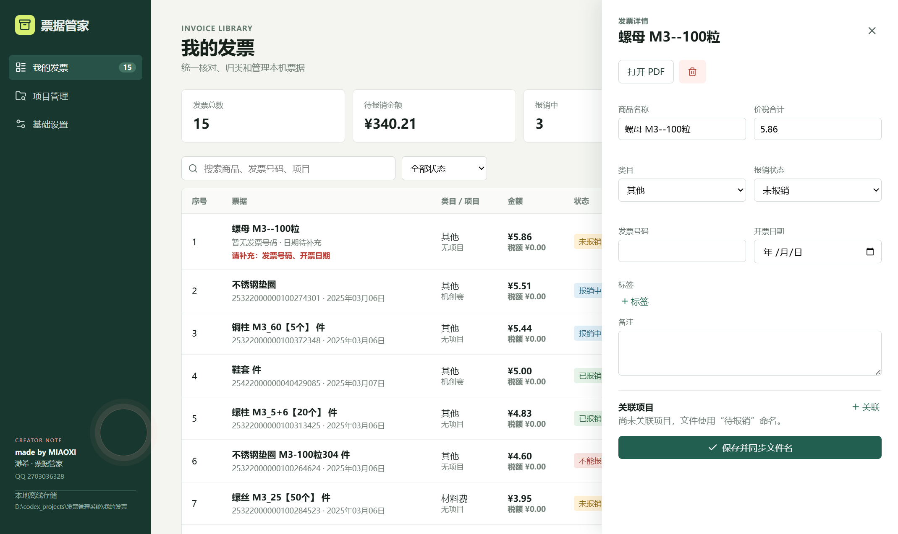
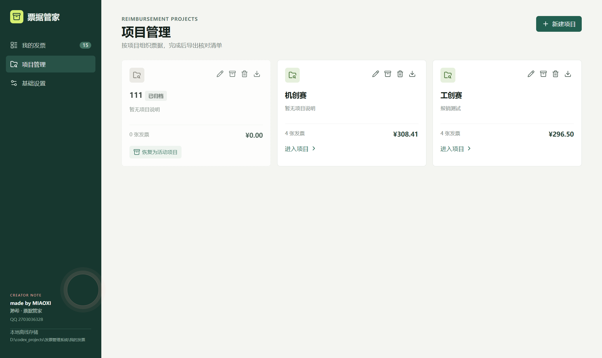
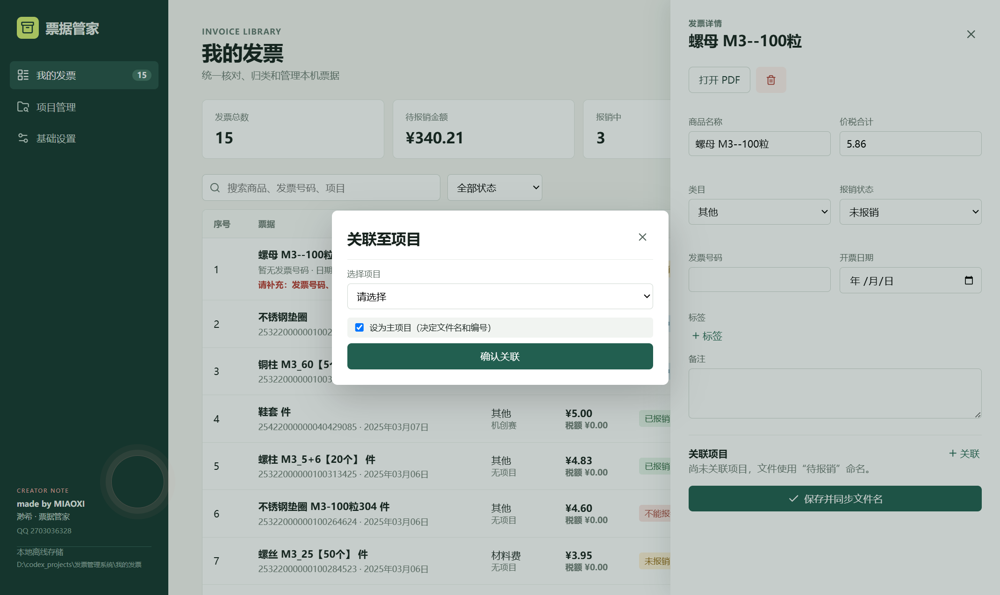
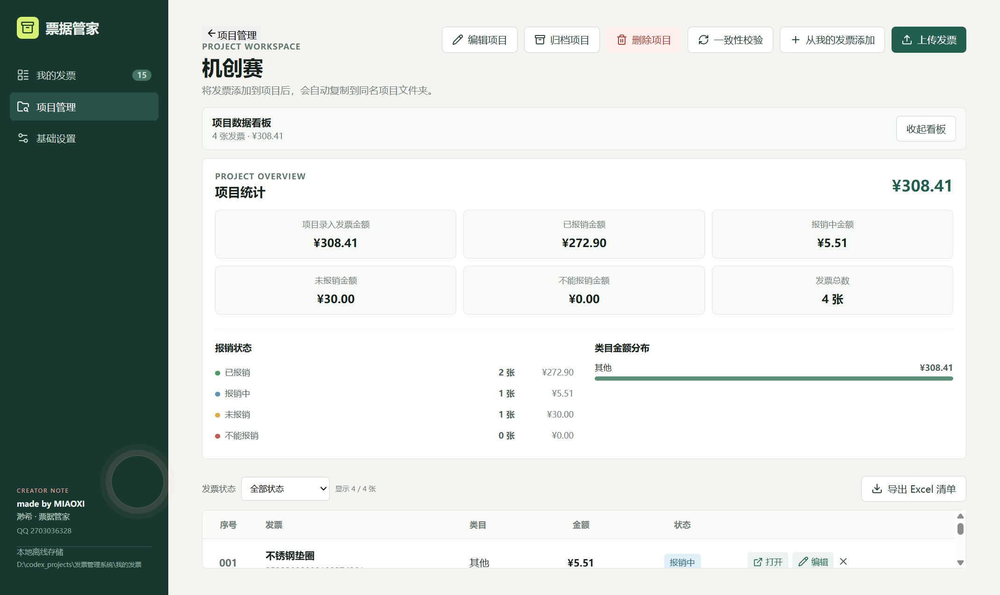
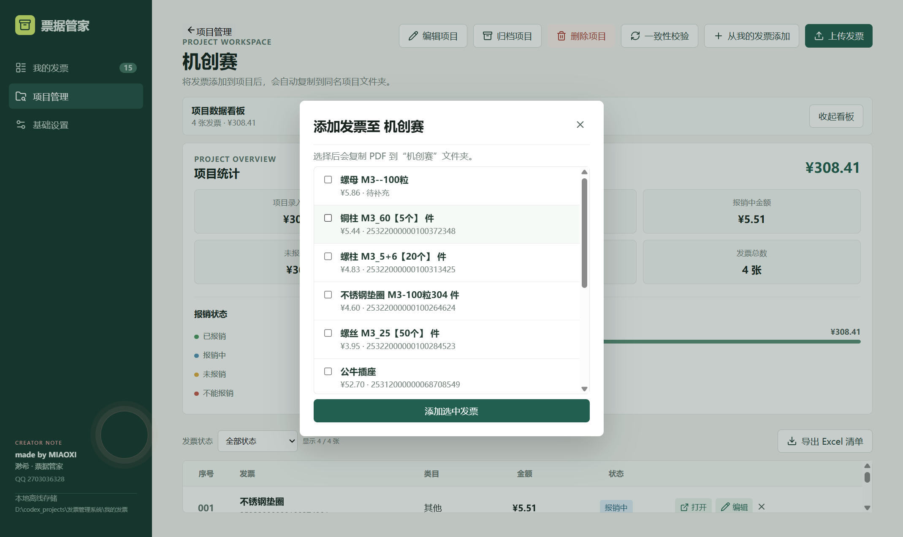

# 票据管家

票据管家是一款适用于 Windows 的本地发票与报销项目管理工具。它适合学生竞赛、科研课题、实验室和个人报销：把电子发票 PDF、项目归类、报销进度、文件命名和 Excel 清单放在同一个应用中管理。

> **适合第一次使用电脑报销工具的用户。** 不需要安装 Node.js、数据库或任何额外软件；票据默认只保存于本机。

## 安装与第一次打开

1. 在 GitHub 的 **Releases** 页面下载 `票据管家 Setup 1.0.3.exe`（或更新版本）。
2. 双击安装包，按提示安装；安装后可从桌面或开始菜单打开“票据管家”。
3. 第一次打开时，应用会自动创建数据文件夹：`文档\票据管家\我的发票`。
4. 先打开左侧的 **基础设置**，确认发票文件夹位置。若你的 PDF 已存放在其他磁盘，点击 **选择文件夹** 改为那个文件夹即可。

安装包已经包含运行所需组件。普通使用者无需下载源码，也无需执行任何命令。

## 5 分钟上手

按下面顺序操作即可完成第一次整理：

1. 在 **基础设置** 确认发票文件夹。
2. 到 **我的发票** 点击“导入 PDF”，或把 PDF 放进文件夹后点击“扫描文件夹”。
3. 查看导入结果；有“待人工补充”的票据，点击“编辑”补齐信息。
4. 到 **项目管理** 新建一个报销项目，并把相关发票添加进去。
5. 在项目中核对金额和报销状态，点击“导出 Excel 清单”。
6. 报销完成后，把项目归档，日后仍可查看或恢复。

## 图文操作手册

以下截图使用默认的 **绿色 + 浅色模式**。截图中的项目和票据仅用于展示界面，实际使用时会显示你的本地数据。

### 基础设置：先告诉应用文件放在哪里



基础设置中的每个区域都可以直接使用：

- **发票文件夹**：这是应用管理 PDF 的位置。点击“选择文件夹”后，应用扫描该位置的 PDF；解析成功的主文件会自动按规则命名，方便日后在资源管理器中查找。
- **界面主题**：默认是绿色浅色模式。你也可以切换蓝色、橙色、粉色或渺希花语主题，并选择深色模式；只改变外观，不影响票据数据。
- **报销状态**：默认有“未报销、报销中、已报销、不能报销”。需要单位特有状态时，点击“新建”。
- **报销类目**：用于按用途统计和导出，例如材料费、设备费、差旅费。可自行新建。
- **自定义标签**：用于附加提醒或标记，例如“缺合同”“已签字”“待导师确认”。标签可在编辑单张发票时勾选。

### 我的发票：导入、核对、搜索和修改



#### 导入 PDF

你可以任选一种方式：

1. 点击右上角 **导入 PDF**：从电脑中选择一张或多张电子发票。
2. 点击 **扫描文件夹**：把 PDF 先放入已设置的发票文件夹，再让应用批量读取。

导入完成后会显示新增、重复、跳过和待人工补充的数量。应用会通过文件指纹、路径和发票号码识别重复票据，重复的 PDF 不会重复记账。

#### 看懂列表

- 顶部卡片显示发票总数、未报销金额、报销中数量和待人工补充数量。
- 搜索框支持按 **商品名称、发票号码或项目名称** 查找；右侧下拉框可按报销状态筛选。
- 每一行显示商品、发票号码、日期、类目、所属项目、金额、税额、报销状态和解析状态。
- 双击某一行或点击 **打开** 可直接打开原始 PDF；点击 **编辑** 打开该票据的详细信息。

#### 处理“待人工补充”

带橙色“待人工补充”的票据并不代表不能使用，只是 PDF 中有字段未被正确识别。请按下面处理：

1. 点击该票据的 **编辑**。
2. 根据原始 PDF 补全红字提示的字段，通常是商品名称、价税合计、发票号码或开票日期。
3. 选择正确的类目和报销状态，点击 **保存并同步文件名**。
4. 如果 PDF 是可复制文字的电子发票，也可先点击 **重试** 重新解析。

扫描件或图片型 PDF 往往无法自动读取文字，需要手动填写；金额默认使用票面的“价税合计（小写）”。

#### 编辑一张发票时能做什么

在编辑抽屉中可以：



- 修改商品名称、价税合计、发票号码、开票日期、类目和报销状态。
- 勾选已有标签，或点击“标签”新建一个标签。
- 填写备注，例如报销单号、采购用途或需要补交的材料。
- 点击“关联”把发票加入一个或多个项目，并可指定其中一个为 **主项目**。
- 点击“打开 PDF”再次核对原件。
- 点击垃圾桶只会移除本应用中的记录，**原始 PDF 会保留**；适合误导入时使用。

保存后，应用会把主文件同步为易读的文件名，例如：

```text
项目名-001-19.90-商品名称-未报销.pdf
无项目-001-金额-商品名称-状态.pdf
```

### 项目管理：把同一笔报销放到一起



#### 新建、编辑与进入项目

点击右上角 **新建项目**，输入项目名称和可选说明，例如“2026 竞赛报销”或“课题材料采购”。项目卡片会显示发票张数和累计金额。点击 **进入项目** 可查看项目中的所有票据。

项目卡片右上角的图标依次可用于：编辑项目名称与说明、归档或恢复、删除项目、导出该项目 Excel。

#### 给项目添加发票

进入活动项目后有两种方式：

1. **上传发票**：直接选择新的 PDF；应用会导入它，并自动关联到当前项目。
2. **从我的发票添加**：勾选已经导入过的票据，再点击“添加选中发票”。

关联成功后，应用会把 PDF 副本放入同名项目文件夹；“所有发票”中仍保留主文件。你可以在项目内点击 `×` 移除关联，这不会删除主文件或其他项目中的关联。

同一张发票可以服务于多个项目。若需要确定文件名和项目内编号，请在发票详情的“关联项目”中将其中一个设为 **主项目**。



#### 查看项目统计与导出

在项目详情中：



- 点击 **展开看板** 可查看项目总额、各报销状态的金额和张数，以及各类目的金额分布。
- 使用“发票状态”筛选当前项目的票据。
- 点击 **导出 Excel 清单**，会在项目文件夹生成该项目的报销清单。
- 在“我的发票”页面点击 **导出全部 Excel**，会生成一份总清单，并为每个项目生成独立的 Sheet。

当项目已有票据而你还想加入其他已导入的发票时，点击“从我的发票添加”，勾选需要的票据后再确认即可：



#### 归档、恢复与删除项目

- **归档**：适用于已结束的报销。项目和票据记录仍会保留，项目文件前缀会标记为“已报销项目”；需要继续处理时可点击“恢复为活动项目”。
- **删除项目**：项目文件夹会移入回收站，“所有发票”中的主文件会保留。因此删除前请确认不再需要该项目的副本。
- **一致性校验**：项目详情页的“**一致性校验**”会检查主文件、项目副本、项目名称、序号和报销状态是否一致，并自动同步可修复的问题。适合手动改过文件名、移动过文件，或发现项目内容不一致时使用。

## 文件如何保存

应用会在所选的数据目录中维护以下结构：

```text
我的发票/
├─ 所有发票/          每张发票的主文件
├─ 项目名称 A/        该项目的 PDF 副本与 Excel 清单
└─ 项目名称 B/
```

请尽量通过应用导入、关联、归档和改状态，而不要在资源管理器中随意改名或移动票据。若已经手动移动过，可进入项目后运行“一致性校验”。

## 常见问题

**为什么导入后显示“待人工补充”？**

该 PDF 可能是扫描件、图片型 PDF，或票据文字排版无法自动读取。打开原件并在编辑页手动填写缺失字段即可。

**为什么同一张 PDF 没有再次导入？**

应用检测到文件、路径或发票号码重复，会跳过它以避免重复报销。请先搜索发票号码确认已有记录。

**误删了一张发票怎么办？**

发票详情中的删除只移除应用记录，PDF 会保留在电脑上；将它重新导入即可。项目删除则会把项目文件夹移入 Windows 回收站。

**我的发票会上传到网络吗？**

不会。应用不使用云端 OCR，PDF 和票据信息默认只保存在本机。SQLite 数据库位于应用的本地用户数据目录，文件名为 `invoices.sqlite`。

**如何备份数据？**

关闭应用后，复制“我的发票”文件夹到移动硬盘或网盘备份；如需完整保留项目、状态和标签，也请一并备份应用用户数据目录中的 `invoices.sqlite`。

## 开发者（可选）

以下内容仅供需要修改或重新打包应用的开发者使用，普通用户可忽略：

```powershell
npm install
npm run dev       # 开发运行
npm test          # 运行测试
npm run dist      # 生成 Windows 安装包
```

安装包输出在 `发布产物/release/`。发布开源仓库前，请确认 `我的发票/` 中不含真实票据或其他隐私数据。

## 许可证

尚未指定许可证。
